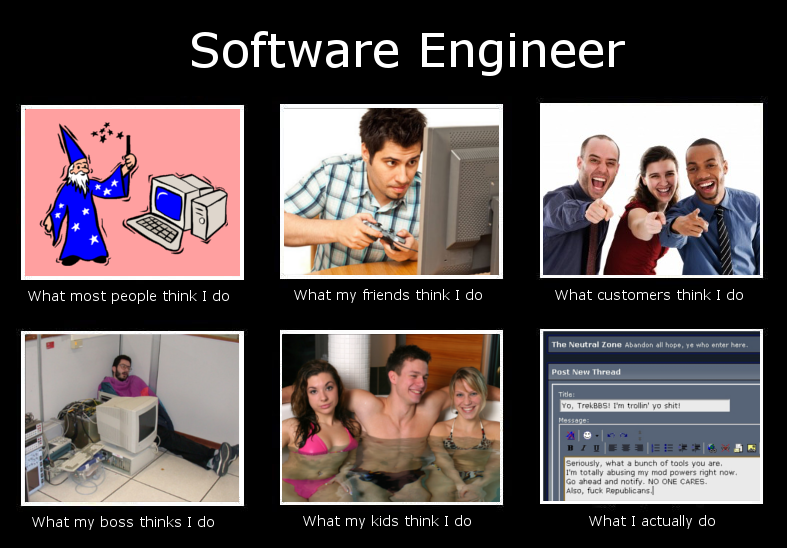

# Rongrong's User Page

You can visit my [personal website](https://lorirongrong.github.io/Me/) to see my resume and my projec! I **tried** to update the code during the winter break but I was occupied by other things in my life. 

## I sometime find quotes interesting
Some words really inspired me. The one below is interesting because I often struggle too much with past mistakes.
> “Don’t Let Yesterday Take Up Too Much Of Today.” – Will Rogers

Some code really inspired me because how prevalent they are, like:
```
hello world 
```
## Special links 
[relational links to an empty file](./linked_file.txt)

Also if you would like some memes:



## [Section Links](#My-Goal-for-2021)


## What I am up to  
- 🌱 learning React.js --> want to have more freedom to make it ***good-looking and human-centered*** when building applications 
- :thinking: I’m looking for ideas on how to better combine CompSci & CogSci in research! 
- :speech_balloon: Ask me about anything [here](https://github.com/LoriRongrong/LoriRongrong/issues)


### My Goal for 2021
- [ ] ~~Maintain a healthier sleep schedule~~ (this is simply impossible)
- [x] Learn more software engineering 
- [ ] Take case of my family
- [ ] Be happy and grateful 

